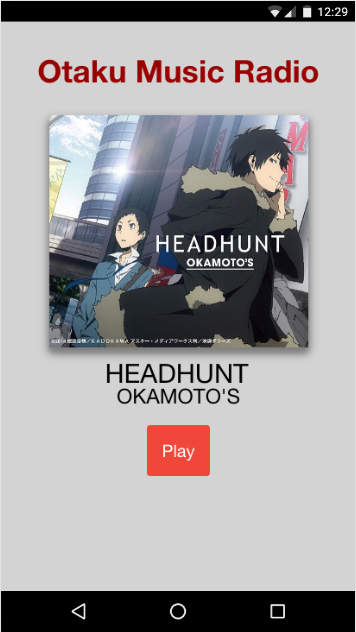

# otaku-music-radio-player
Reproductor de Otaku Music Radio para Android/iOS. Creado con Ionic y AngularJS.

### Desarrollo

Requiere [Ionic Framework](http://ionicframework.com/getting-started/).

Requiere Android SDK.

[Opcional] VisualStudio 2015 (Windows)

    npm install -g cordova
    npm install -g ionic

### Plugins

Depende algunos plugins de Cordova para funcionar correctamente.

    cordova plugin add cordova-plugin-whitelist

#### Depurar en Android

Conecta tu smartphone Android mediante USB, y asegúrate de tener iniciado el modo desarrollador y la depuración USB habilitada. Luego ejecuta:

`$ ionic run android`

Usa la consola de las DevTools de Google Chrome (v50) para visualizar en vivo los resultados.

### Capturas de pantalla

